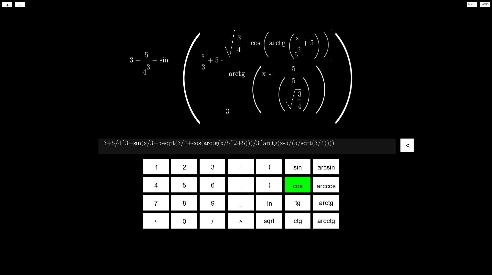
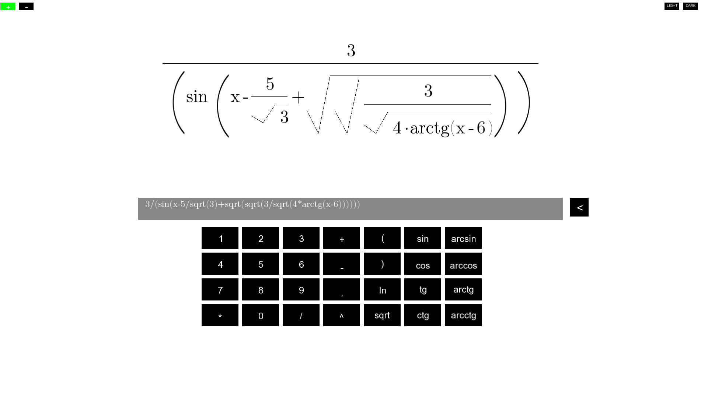

# SFML Math Formula Renderer  

This is a C++ project using SFML that takes a string input and converts it into a mathematical formula displayed on the screen (similar to LaTeX rendering). The string is parsed using a **binary tree** that stores the components of the formula, allowing structured representation and rendering.  

## Technologies Used  
- **C++** for logic and structure  
- **SFML** for graphics and rendering  
- **Binary Tree** for parsing and storing the formula components  

##  Features  
- Takes user input as a string  
- Parses the input into a structured binary tree  
- Displays the formula on-screen in a formatted way  

##  Setup  
1. Install **SFML**  
2. Compile the project using a C++ compiler  
3. Run the executable and enter a mathematical expression  

## Screenshots

